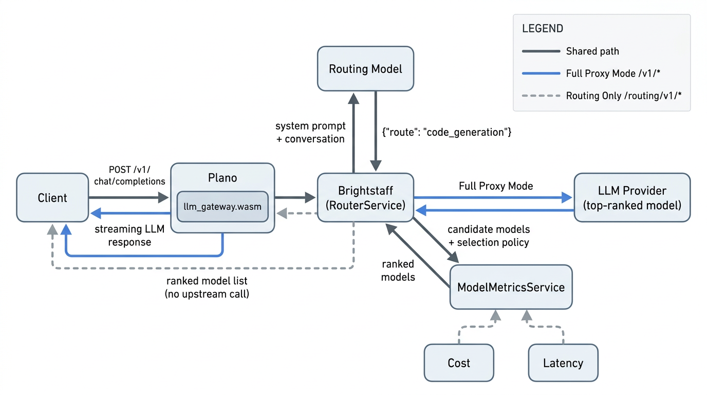
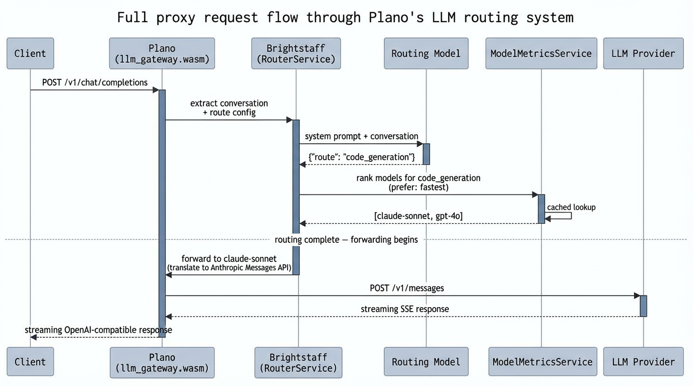
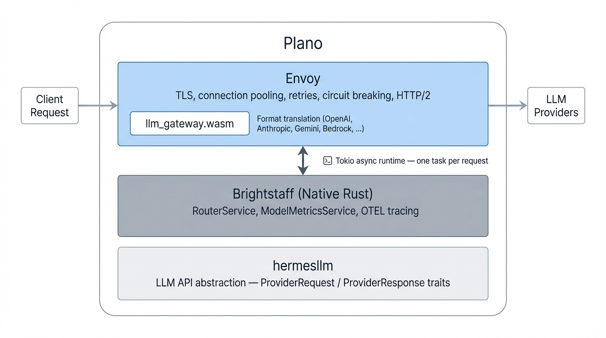

**Meta title**: How We Built Inference Router: Purpose-Built LLM Routing at Infrastructure Speed
**Meta description**: Inside DigitalOcean's Inference Router—how we use purpose-built models and live metrics to route LLM requests to the right model, fast.
**Byline**: Adil Hafeez
Banner image: [https://doimages.nyc3.cdn.digitaloceanspaces.com/007BlogBanners2024/offer(lavender).png](https://doimages.nyc3.cdn.digitaloceanspaces.com/007BlogBanners2024/offer\(lavender\).png)
URL: /inference-router-architecture

Most teams building on LLMs today make a single model decision and apply it uniformly across every request. They reach for a frontier model because the highest-stakes tasks demand it—and pay the cost and latency overhead for every task, including the ones that don't require it. Routing dissolves that tension. It gives developers the ability to match the right model to the right task, resulting in faster systems where responsiveness matters and better economics where scale matters.

We built [DigitalOcean's Inference Router](https://cloud.digitalocean.com/model-studio/router/catalog) to bring this capability to our inference platform. It evaluates each incoming request, assesses the task, and selects the best-fit model from a configured pool—optimizing for cost, latency, or ranked preference. Under the hood, it's powered by [Plano](https://github.com/katanemo/plano), an open-source AI-native proxy originally developed at Katanemo ([now part of DigitalOcean](https://www.digitalocean.com/blog/digitalocean-acquires-katanemo-labs-inc)), using purpose-built routing models that resolve intent in around 200ms.

This article is a deep dive into how we built it: the product surface, the purpose-built models that power intent resolution, the live ranking engine, and the Envoy-based infrastructure underneath.

## DigitalOcean's Inference Router

The fastest way to start routing is with a **preset router**. Inference Router ships with presets for common workflows—Software Engineering, General, Writing, and Knowledge Base & Document Intelligence.

Each preset's model recommendations come from a hybrid evaluation methodology. We combine public benchmark signals from leading leaderboards to identify top candidates per task, then validate through in-house benchmarking on curated task-specific datasets. Final recommendations are confirmed by DigitalOcean's data science team using automated scoring and human evaluation. Where open-source models deliver comparable accuracy to closed-source alternatives for a specific task, we recommend them—and where they don't, we recommend the frontier closed-source model.

Presets support three selection policies: **Optimal** (DigitalOcean's recommended model ordering based on this hybrid evaluation), **Cost Efficiency** (prioritize lowest cost), and **Speed Optimization** (prioritize lowest latency). Pick one from the [router catalog](https://cloud.digitalocean.com/model-studio/router/catalog) and you're routing in minutes.

Using a preset is a drop-in replacement for any model call—prefix the router name with `router:` in the model field:

```
curl -s https://inference.do-ai.run/v1/chat/completions \
  -H "Authorization: Bearer $MODEL_ACCESS_KEY" \
  -H "Content-Type: application/json" \
  -d '{
    "model": "router:software-engineering",
    "messages": [
      {"role": "user", "content": "Write a Python function to sort a list of dictionaries by key"}
    ]
  }'
```

The response tells you which model was selected (in the `model` field) and which task matched (via the `x-model-router-selected-route` header). If no task matches, the request falls through to the router's configured fallback models, tried in order.

When you need more control or want to customize routing for your own use case, **custom routers** are the way to go. Each task has a name, a natural-language description (used for intent matching), a pool of eligible models, and a selection policy (`cheapest`, `fastest`, or ranked order):

```
curl -X POST "https://api.digitalocean.com/v2/gen-ai/models/routers" \
  -H "Authorization: Bearer $MODEL_ACCESS_KEY" \
  -H "Content-Type: application/json" \
  -d '{
    "name": "my-coding-router",
    "policies": [
      {
        "custom_task": {
          "name": "code-generation",
          "description": "Generate new code, write functions, or create boilerplate"
        },
        "models": ["openai-gpt-5.2", "anthropic-claude-sonnet-4.5"],
        "selection_policy": { "prefer": "fastest" }
      },
      {
        "custom_task": {
          "name": "bug-fixing",
          "description": "Identify and fix errors or bugs in user-supplied code"
        },
        "models": ["openai-gpt-5.2", "glm-5"],
        "selection_policy": { "prefer": "cheapest" }
      }
    ],
    "fallback_models": ["openai-gpt-oss-120b"]
}'
```

You can test routing behavior in the [Playground](https://cloud.digitalocean.com/model-studio/router/catalog)—compare a router against a single model side by side, with cost and latency differences visible per request. The [Analyze dashboard](https://cloud.digitalocean.com/model-studio/router/catalog) shows aggregate metrics: total requests, token usage, task match rate, and fallback rate.

## How It Works: Plano Under the Hood

When a request hits Inference Router, here's what happens inside [Plano](https://github.com/katanemo/plano).

Every routing decision happens in two phases. First, a purpose-built small language model (SLM) resolves user intent by matching the conversation against natural-language task descriptions. Second, a ranking engine orders the matched task's candidate models using live cost and latency data from pluggable metrics sources—including DigitalOcean's pricing API and Prometheus.



In full proxy mode, Plano handles the entire lifecycle: classify intent, rank models, forward to the top-ranked provider, translate between API formats (OpenAI <-> Anthropic <-> Gemini <-> Bedrock), and stream the response back. Existing OpenAI SDK clients work unchanged.

Under the hood, an Inference Router configuration translates to a Plano routing config. Each task becomes a route with a natural-language description, a model pool, and a selection policy:

```
routing_preferences:
  - name: code_generation
    description: generating new code, writing functions, or creating boilerplate
    models:
      - anthropic/claude-sonnet-4-20250514
      - openai/gpt-4o
    selection_policy:
      prefer: fastest

  - name: complex_reasoning
    description: complex reasoning tasks, multi-step analysis, or detailed explanations
    models:
      - openai/gpt-4o
      - openai/gpt-4o-mini
    selection_policy:
      prefer: cheapest
```

The task descriptions are what the routing model sees—they're passed directly into its prompt as natural language. The `selection_policy` tells the ranking engine which metric to optimize.

For long conversations, the prompt is trimmed to fit the model's token budget without running a full tokenizer on the hot path. The system keeps the most recent turns (capped at 16), and if the last user message still overflows the budget, it uses a middle-trim strategy—preserving roughly 60% from the start and 40% from the end, separated by an ellipsis. The rationale: users tend to frame the task at the beginning of a long message and put the actual ask at the end, so preserving both edges gives the routing model better signal than a head-only truncation.

## The Routing Model

The routing service is model-agnostic by design. The architecture doesn't care which model resolves intent, as long as it returns a JSON routing decision. But the choice of model matters for accuracy, latency, and what kinds of routing are possible. We've iterated through two generations.

### V1: Arch-Router — The Foundation

Our first routing model, [Arch-Router](https://huggingface.co/katanemo/Arch-Router-1.5B), is a 1.5B generative language model fine-tuned specifically for single-route classification. Given a conversation and a set of route descriptions, it returns `{"route": "code_generation"}` or `{"route": "other"}` if nothing matches. We published the methodology and evaluation in [Arch-Router: Aligning LLM Routing with Human Preferences](https://arxiv.org/abs/2506.16655).

The key result: Arch-Router outperforms every frontier model we tested on routing accuracy, at a fraction of the latency:

| Model | Latency (ms) | Overall Accuracy |
| :---- | :---- | :---- |
| Arch-Router | **51 ± 12** | **93.17%** |
| Claude 3.7 Sonnet | 1450 ± 385 | 92.79% |
| GPT-4o | 836 ± 239 | 89.74% |
| Gemini 2.0 Flash | 581 ± 101 | 85.63% |
| GPT-4o-mini | 737 ± 164 | 82.79% |

93.17% accuracy at 51ms—28x faster than Claude, **10x faster** than Gemini-flash-lite—proved that a purpose-built small model could replace frontier models for routing without sacrificing quality. This validated the core design decision: you can put a real model in the request path at infrastructure speed.

### V2: Plano-Orchestrator

Arch-Router validated the approach, but production workloads pushed us further. Real conversations are messy. Users send ambiguous follow-ups ("do the same for New York"), shift topics mid-conversation, or send messages that don't need routing at all. We needed a model that generalizes better across these patterns.

[Plano-Orchestrator](https://huggingface.co/katanemo/Plano-Orchestrator-4B) is the routing model that powers DigitalOcean's Inference Router today. It uses the same generative approach—route descriptions in the prompt, JSON output—but is trained on richer conversational data that covers context-dependent routing, multi-turn flow handling (follow-ups, clarifications, corrections), and negative case detection (recognizing when no specialized routing is needed). The result is a model that generalizes significantly better across diverse routing scenarios.

The model is available in the [Plano-Orchestrator collection](https://huggingface.co/collections/katanemo/plano-orchestrator) in two sizes: a [4B dense model](https://huggingface.co/katanemo/Plano-Orchestrator-4B) for low-latency deployments and a [30B-A3B MoE model](https://huggingface.co/katanemo/Plano-Orchestrator-30B-A3B) for higher accuracy, each with FP8 quantized variants. We evaluated across 1,958 user messages in 605 multi-turn conversations with over 130 different agents:

| Model | General | Coding | Long-context | Avg. Perf |
| :---- | :---- | :---- | :---- | :---- |
| **Plano-Orchestrator-30B-A3B** | **88.87** | **83.51** | **86.81** | **87.84** |
| GPT-5.1 | 89.71 | 77.54 | 81.28 | 86.93 |
| Claude Sonnet 4.5 | 88.53 | 74.39 | 85.53 | 86.11 |
| **Plano-Orchestrator-4B** | **87.41** | **71.23** | **84.26** | **84.68** |
| Gemini 2.5 Flash | 84.42 | 66.32 | 82.13 | 81.51 |
| Claude Haiku 4.5 | 81.99 | 72.63 | 85.53 | 81.05 |
| Gemini 2.5 Pro | 83.38 | 67.02 | 81.28 | 80.75 |
| GPT-5 | 81.64 | 70.18 | 63.40 | 77.78 |
| GPT-5 mini | 70.10 | 61.40 | 58.72 | 67.47 |

The 30B-A3B MoE model leads at 87.84% average performance—ahead of GPT-5.1 (86.93%) and Claude Sonnet 4.5 (86.11%). The 4B dense model scores 84.68%, competitive with frontier models at a fraction of the inference cost.

The coding category shows the largest gap: Plano-Orchestrator-30B-A3B scores 83.51% vs. GPT-5.1's 77.54% and Claude Sonnet 4.5's 74.39%. This is where purpose-built training pays off most. Coding queries involve ambiguous intent ("fix this," "make it faster," "try again") that requires conversational context to route correctly, and a model trained specifically on routing patterns handles this better than a general-purpose model prompted to classify.

Here's how the routing model fits into the full proxy request path:



Switching between routing models is a config change—not a code change. The ranking engine, metrics sources, and transport layer are all model-agnostic. We'll cover the full model evolution from Arch-Router to Plano-Orchestrator in a follow-up post.

## The Ranking Engine: Live Cost and Latency Data

Knowing the right *task* is only half the problem. Within a task, you might have three candidate models. The best one depends on whether you're optimizing for cost or latency right now. Static ordering doesn't cut it because model pricing changes, latency drifts with load, and rate limits shift availability.

The ranking engine continuously fetches cost and latency data from external sources. For Inference Router, cost data comes from [DigitalOcean's Gen AI pricing API](https://docs.digitalocean.com/products/gradient-ai-platform/details/pricing/) by default; latency data comes from Prometheus. The interface is extensible to other sources.

The ranking algorithm is straightforward:

1. Read the latest cost and latency snapshots from the in-memory cache.
2. Based on the task's selection policy (`cheapest`, `fastest`, or `none`):
   - **Cheapest**: Sort candidate models by cost (ascending). Models with no cost data are pushed to the end.
   - **Fastest**: Sort candidate models by latency (ascending). Models with no latency data are pushed to the end.
   - **None**: Return models in their original config order—no reranking.
3. For any model missing metric data, log a warning (both at startup and per-request) so misconfigurations surface early without hard-failing on transient metric gaps.

The result is an ordered list where the top model is the best match for the policy, and models without data are still available as fallback but won't be preferred. A `model_aliases` map bridges naming differences between metrics sources and your routing config—so a pricing catalog using `openai-gpt-4o` maps cleanly to `openai/gpt-4o` in your task definition.

Plano validates the full metrics configuration at startup—mismatched selection policies, duplicate sources, models missing from providers—and crashes with a specific error message rather than silently falling back to default ordering.

## Under the Hood: Envoy, WASM, and Async Rust

The routing service runs inside Plano's three-layer architecture.



**Envoy** handles TLS, connection pooling, retries, circuit breaking, and HTTP/2 multiplexing. What matters for routing specifically is the threading model: one event-loop worker per CPU core, each connection pinned to a single worker. No lock contention in the hot path. For streaming LLM responses—long-lived, chunked HTTP connections—this scales naturally without coordination overhead.

**The `llm_gateway.wasm` filter** runs inside Envoy's process. Not as a sidecar, not as a separate service. It handles format translation between providers (OpenAI, Anthropic, Gemini, Mistral, Groq, DeepSeek, xAI, Bedrock) at wire speed with zero network hop. The WASM sandbox imposes strict constraints: **no std networking, no tokio, no async runtime**, and all dependencies must be `no_std`\-compatible. The format translation layer is powered by `hermesllm`, our Rust crate for LLM API abstraction. Adding a new provider means implementing `ProviderRequest` and `ProviderResponse` traits. The router and gateway don't need to change.

**Brightstaff** is a native binary that runs alongside Envoy and handles the routing logic, including intent resolution, model ranking, and OTEL tracing. It uses a lightweight async task per request rather than a thread per request, so it handles thousands of concurrent routing decisions on modest hardware. For a proxy in the hot path of streaming LLM responses, predictable tail latency matters. Garbage collector pauses in the routing layer would propagate as stutter in token delivery. Brightstaff is written in Rust, which eliminates this class of issues entirely: no garbage collector, no stop-the-world pauses, deterministic memory reclamation. The metrics cache uses a read-optimized concurrent data structure—every request reads from it, but writes only happen on the refresh interval, so contention is near-zero in practice.

## Getting Started

**On DigitalOcean**: Create an Inference Router from the [router catalog](https://cloud.digitalocean.com/model-studio/router/catalog)—pick a preset or build a custom router via the API or UI. No GPU management, no infrastructure to run. Use it by setting `"model": "router:your-router-name"` in any OpenAI-compatible API call.

**Self-hosted**: The routing engine is open source as [Plano](https://github.com/katanemo/plano). The routing models run on vLLM—Arch-Router (1.5B quantized) fits on a single NVIDIA L4; the larger Plano-Orchestrator models run on an NVIDIA L40S. The [demo repo](https://github.com/katanemo/plano/tree/main/demos/llm_routing/model_routing_service) includes Kubernetes manifests, Docker Compose files, and a Plano config for self-hosting.

## What We Learned

Building and operating this in production surfaced a few non-obvious lessons:

### Purpose-built models beat general-purpose models for routing—if you have the training data

Our first routing model (Arch-Router, 1.5B) outperformed Claude 3.7 Sonnet on routing accuracy at 28x lower latency. The intuition is that routing is a narrow, well-defined task—the model doesn't need to generate prose or handle tool calls. It needs to read a conversation, compare it against route descriptions, and emit a JSON object. That's a much smaller capability surface than what a frontier model provides, and a purpose-built model can cover it with high accuracy if the training data is representative. This principle held as we scaled up to Plano-Orchestrator: the task-specific approach continues to outperform general-purpose models across broader routing scenarios.

### Route descriptions are a new kind of prompt engineering

The routing model is trained to match user prompts to user-defined tasks—the natural-language descriptions in your config are the interface. This means the quality of your routing depends heavily on how you write those descriptions. "Handle code stuff" matches everything; "write Python functions for data processing pipelines" misses "help me debug this JavaScript." Finding the right level of specificity—broad enough to catch real traffic, precise enough to distinguish between routes—is prompt engineering applied to infrastructure config. Teams don't expect this skill when setting up a router, but it's where most routing accuracy issues originate in practice. This is also why Inference Router ships with preset routers—benchmarked task descriptions that work out of the box for common workflows.

### Live metrics ranking is more useful than static config because model performance drifts

Provider latency varies by 2-3x throughout the day based on traffic patterns. A model that's "fastest" at 2am is often the slowest at 2pm. The implementation runs a background loop per metric source that fetches fresh data on a configurable interval and updates an internal thread-safe cache. Reads are non-blocking during refresh, so there's no latency impact on in-flight routing decisions.

### The WASM sandbox constraint produces cleaner code

This applies specifically to the `llm_gateway.wasm` filter that runs inside Envoy—not to Brightstaff, which runs as a native binary. The WASM sandbox strips away the tools you'd normally reach for—no networking stack, no async runtime, no system calls. What's left is a callback-driven architecture where the proxy controls all I/O and your filter code only handles the logic. This constraint is painful during development, but it produces filters that are small (single-digit MBs), deterministic, and easy to audit—you can trace every external interaction from the source alone. It also gives you strong isolation guarantees: a bug in a WASM filter can't crash the proxy or leak memory outside its sandbox.

## What We're Exploring Next

Inference Router is one piece of a broader effort at DigitalOcean to build production infrastructure for agentic AI. In an upcoming post, we'll cover the model evolution from [Arch-Router](https://arxiv.org/abs/2506.16655) to [Plano-Orchestrator](https://huggingface.co/katanemo/Plano-Orchestrator-30B-A3B)—how we trained purpose-built routing models at different scales and what we learned about generalization across diverse routing scenarios.

We're also investing in research on adjacent problems. Our paper [Signals: Trajectory Sampling and Triage for Agentic Interactions](https://arxiv.org/abs/2604.00356) tackles observability for agentic systems—how to identify informative agent trajectories in production without reviewing every interaction.

The routing engine is open source as part of [Plano](https://github.com/katanemo/plano). Try [Inference Router](https://cloud.digitalocean.com/model-studio/router/catalog) on DigitalOcean, or run Plano self-hosted with the [demo](https://github.com/katanemo/plano/tree/main/demos/llm_routing/model_routing_service).

*Inference Router was built by a team across DigitalOcean's CPTO and inference platform organizations, including Prasad Prabhu, Nirmal Chander Srinivasan, Tyler Gillam, Alex Malynovsky, and many others.*
